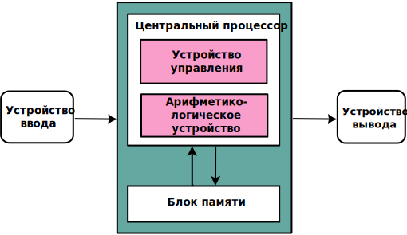
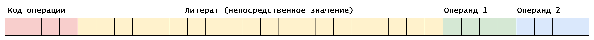

# Эмулятор процессора

Эта программа реализует эмулятор простого процессора с поддержкой набора инструкций для выполнения
операций с регистрами и памятью. Эмулятор использует архитектуру Фон Неймана, где данные и инструкции
хранятся в одной и той же памяти.

<div style="text-align: center">
  
</div>

## Система команд

Каждая команда имеет фиксированную структуру длиной 32 бита, которая организована следующим образом:



**[31-28] — код операции (operationCode)**:
- Это старшие 4 бита команды, определяющие тип выполняемой операции. Каждому коду операции соответствует конкретная
  инструкция (например, MOV, ADD, SUB и т.д.).

**[27-9] — литерал (indirect)**:
- Эти 19 бит используются как литерал, который может быть интерпретирован как адрес метки или непосредственное значение.
- Литерал может использоваться для передачи адреса в инструкции перехода.

**[8-5] — операнд 1**:
- Четыре бита, используемые для указания первого операнда. На данный момент поддерживаются только регистры
  (например, R0, R1, R2 и т.д.).

**[4-0] — операнд 2**:
- Пять бит, используемые для указания второго операнда. Этот операнд может принимать несколько форм:
    - Чтение значения из регистра: `MOV eax, edi`
    - Чтение адреса из регистра: `MOV eax, [edi]`
    - Чтение из памяти: `MOV eax, [Vec_1]`
    - Чтение литерала: `MOV eax, 1`

## Пример использования

Для записи программы в память эмулятора используется команда, которая следует описанной выше структуре. Программа
может быть загружена в оперативную память для выполнения инструкций в соответствии с логикой эмулятора.

Ниже представлен пример ассемблерного кода для поиска максимального значения в массиве. Здесь массив `Vec_1` в
разделе `.data` содержит несколько значений. Первый элемент массива указывает количество оставшихся элементов для
поиска максимума.

```asm
global _start

section .data
    Vec_1 db 5, -128, -64, -3, -5, -6   ; Первый элемент — размер массива

section .text
_start:
    movzx rcx, byte [rel Vec_1]         ; Загружаем размер массива в rcx (количество итераций)
    mov rdi, Vec_1 + 1                  ; Устанавливаем указатель rdi на первый элемент массива
    mov al, [rdi]                       ; Загружаем первый элемент массива в al (максимум по умолчанию)

find_max:
    cmp al, [rdi]                       ; Сравниваем al с текущим элементом массива
    jge skip                            ; Переход, если al >= [rdi] (максимум не меняем)
    mov al, [rdi]                       ; Обновляем максимум, если [rdi] > al
skip:
    inc rdi                             ; Переходим к следующему элементу массива
    loop find_max                       ; Повторяем, пока не дойдем до конца массива

exit:
    movsx rax, al                       ; Перемещаем найденное максимальное значение в rax
    ret                                 ; Завершаем программу
```

### Примечания

- Все значения регистров и памяти могут быть изменены в процессе выполнения команд.
- Эмулятор поддерживает базовые арифметические и логические операции, а также инструкции управления потоком
  (например, переходы).